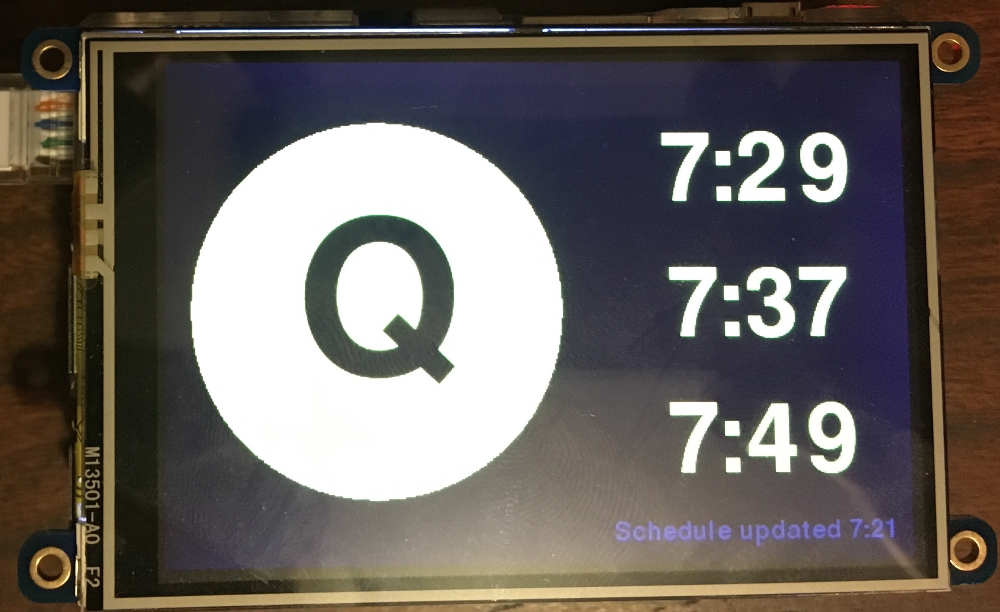

# Raspberry Pi Subway Stop Monitor

<p align="center">
  
</p>

[](https://github.com/nolanbconaway/raspi-nyc-train-display/actions)

This is a raspberry pi application designed to run on a [PiTFT](https://www.adafruit.com/product/2441) which displays upcoming trains to a NYC subway stop.

## Quickstart

> See [this tutorial](raspi-setup.md) for setup instructions for a raspberry pi.

This program consists of two processes: an MTA checker, and a Display updater. They both run as daemons run from the CLI. The easiest way to make sure both are running is through supervisor.

### Get an API Key

To request MTA realtime data, you'll need an API key, [register here](https://datamine.mta.info/user/register).

### Edit supervisord.conf (or supervisord-rpi.conf)

I have set up two supervisor configurations, one for development (works on my macbook pro), and one for use on a raspberry pi (which send the display to frame buffer). In either case you'll need to edit sections like

``` ini
[program:display]
command=python -m traindisplay.display.cli -e --route Q ; Set your route

[program:mta]
command=python -m traindisplay.mta.cli -e --route Q --stop D27N ; Set your route / stop
```

You can look up your stop in [stops.txt](http://web.mta.info/developers/data/nyct/subway/google_transit.zip), or using the [ `underground` command line tool](https://github.com/nolanbconaway/underground#findstops)

### Run supervisor

Install the library, export your API key, then run supervisor.

``` sh
$ pip install .
$ export MTA_API_KEY='...'
$ supervisord -c supervisord.conf

# on a raspberry pi, you must run as root for framebuffer privs
# you might need to sudo pip install . as well!
$ sudo -E supervisord -c supervisord-rpi.conf

# if you don't want supervisor daemonized
$ supervisord -c supervisord.conf --nodaemon
```

## Raspberry Pi Setup

See [this tutorial](raspi-setup.md) for a detailed walkthrough on how to set up your raspberry pi.

## Architecture

For the curious, below are some details concerning how this is all set up. I am terrible at design so this is probably garbage.

This program consists of two processes: an MTA checker, and a Display updater. These processes communicate through a SQLite database so that the display updater knows when updated arrival times are available.

### MTA Checker

The MTA realtime API is queried efficiently, only when I (Nolan) have decided new.information is needed. The rules are based on:

1. The last time the API was queried. At a minimum checking every `N` seconds, default 300, but not more than once per `M` seconds (default 60).
2. When upcoming arrivals are scheduled, checking if a known arrival has elapsed.
3. Check every `M` seconds during "peak" hours, set through an environment variable. This is useful to ensure up-to-date data during hours you usually take the train.

When an update is needed, upcoming arrivals for a specified route and stop are stored within the SQLite database so that the display can show them.

You can run the process via command line:

``` sh
python -m traindisplay.mta.cli --help
Usage: cli.py [OPTIONS]

  Run the main CLI Program.

Options:
  -r, --route [FS|4|W|H|SI|6|Q|2|G|E|1|Z|5|M|R|L|C|F|7|GS|B|N|D|A|J]
                                  Route ID to find stops for. Can be read from
                                  $TRAIN_DISPLAY_ROUTE_ID.  [required]
  -s, --stop TEXT                 Stop ID (from stops.txt) to target. Can be
                                  read from $TRAIN_DISPLAY_STOP_ID.
                                  [required]
  -e, --echo                      Option to print out the updates to the
                                  console.
  --api-key TEXT                  MTA API key. Read from $MTA_API_KEY if not
                                  provided.
  --help                          Show this message and exit.
```

The process reads from the following env variables:

* `MTA_API_KEY` : Your API key.
* `TRAIN_DISPLAY_ROUTE_ID` : The route ID.
* `TRAIN_DISPLAY_STOP_ID` : The stop ID, from [stops.txt](http://web.mta.info/developers/data/nyct/subway/google_transit.zip).
* `TRAIN_DISPLAY_PEAK_HOURS` : Comma delimited list of peak hours, like `'7,8'` .
* `TRAIN_DISPLAY_MIN_WAIT` : Minimum delay seconds between requests. Default 60.
* `TRAIN_DISPLAY_MAX_WAIT` : Maximum delay seconds between requests. Default 300.

### Display Updater

The display is updated whenever new information is available from the MTA checker. It is based on Pygame, which lets me develop on my personal computer but also can work on a Raspberry Pi.

``` sh
python -m traindisplay.display.cli --help
Usage: cli.py [OPTIONS]

  Run the main CLI Program.

Options:
  -r, --route [2|E|FS|R|B|GS|D|4|C|M|5|Z|G|F|A|SI|H|L|N|W|1|6|J|7|Q]
                                  Route ID to find stops for. Can be read from
                                  $TRAIN_DISPLAY_ROUTE_ID.  [required]
  -e, --echo                      Option to print updates to the console.
  --help                          Show this message and exit.
```

On a raspberry pi, you will want this run using under `sudo -E` , otherwise the 
framebuffer interface is not accessible.

* `TRAIN_DISPLAY_ROUTE_ID` : The route ID.
* `SDL_VIDEODRIVER` : Set to `'fbcon'` for framebuffer display on a raspberry pi.
* `SDL_FBDEV` : Set to `'/dev/fb1'` for framebuffer display on a raspberry pi.
* `PYGAME_HIDE_SUPPORT_PROMPT` : Set to `'hide'` to disable the pygame welcome message.

## TODO

* [x] Add better text color for some train likes (e.g., 4, 5, 6).
* [ ] Raspi setup docs. Or host an image somewhere?

